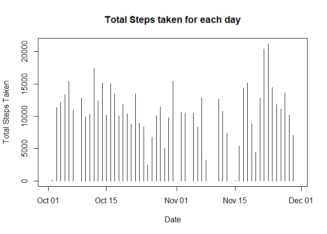
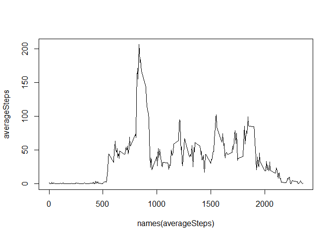
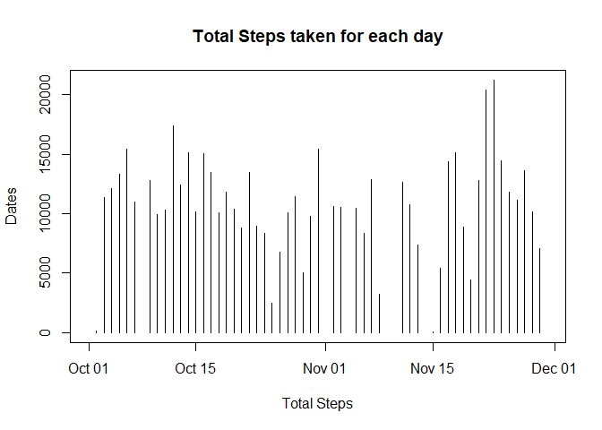
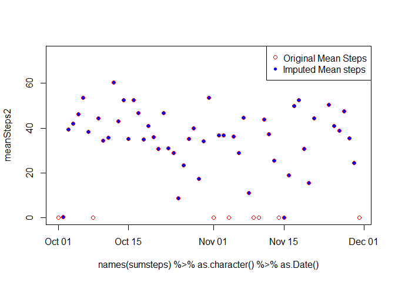
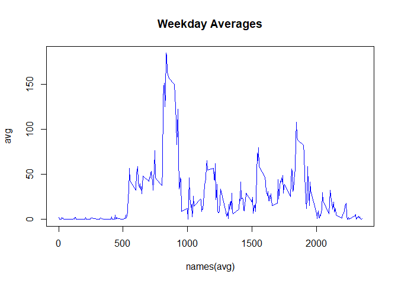
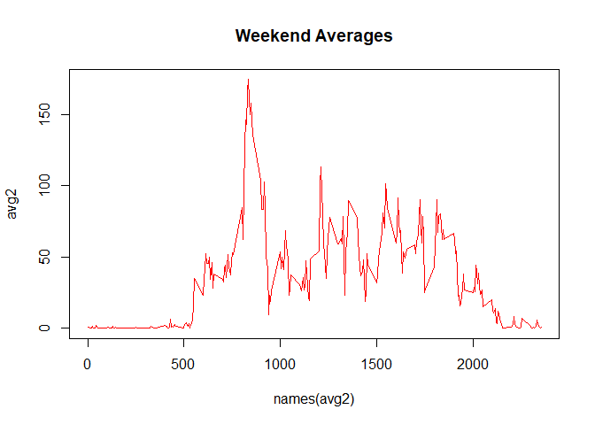

Reading the data
----------------

Lets read the data and see at the top 5 rows

``` r
activity <- read.csv("activity.csv")

print(head(activity))
```

    ##   steps       date interval
    ## 1    NA 2012-10-01        0
    ## 2    NA 2012-10-01        5
    ## 3    NA 2012-10-01       10
    ## 4    NA 2012-10-01       15
    ## 5    NA 2012-10-01       20
    ## 6    NA 2012-10-01       25

Now that we’ve read the data , lets address the tasks .

Tasks
-----

### Make a histogram of the total number of steps taken each day.

``` r
sumsteps <- with(activity , tapply(steps , date , sum))

plot( as.Date(as.character(names(sumsteps))) , sumsteps , type = "h" ,
        xlab = "Date" , ylab= "Total Steps Taken" ,
         main = "Total Steps taken for each day")
```



### Calculate and report the mean and median of the total number of steps taken per day.

``` r
meanSteps <-  with(activity , tapply(steps , date , mean , na.rm = TRUE)) 

medianSteps <- with(activity , tapply(steps , date , median, na.rm = TRUE))

allSteps <- data.frame(MeanSteps =  meanSteps , MedianSteps = medianSteps)
```

### Mean and Median Steps Each day

    ##             MeanSteps MedianSteps
    ## 2012-10-01        NaN          NA
    ## 2012-10-02  0.4375000           0
    ## 2012-10-03 39.4166667           0
    ## 2012-10-04 42.0694444           0
    ## 2012-10-05 46.1597222           0
    ## 2012-10-06 53.5416667           0
    ## 2012-10-07 38.2465278           0
    ## 2012-10-08        NaN          NA
    ## 2012-10-09 44.4826389           0
    ## 2012-10-10 34.3750000           0
    ## 2012-10-11 35.7777778           0
    ## 2012-10-12 60.3541667           0
    ## 2012-10-13 43.1458333           0
    ## 2012-10-14 52.4236111           0
    ## 2012-10-15 35.2048611           0
    ## 2012-10-16 52.3750000           0
    ## 2012-10-17 46.7083333           0
    ## 2012-10-18 34.9166667           0
    ## 2012-10-19 41.0729167           0
    ## 2012-10-20 36.0937500           0
    ## 2012-10-21 30.6284722           0
    ## 2012-10-22 46.7361111           0
    ## 2012-10-23 30.9652778           0
    ## 2012-10-24 29.0104167           0
    ## 2012-10-25  8.6527778           0
    ## 2012-10-26 23.5347222           0
    ## 2012-10-27 35.1354167           0
    ## 2012-10-28 39.7847222           0
    ## 2012-10-29 17.4236111           0
    ## 2012-10-30 34.0937500           0
    ## 2012-10-31 53.5208333           0
    ## 2012-11-01        NaN          NA
    ## 2012-11-02 36.8055556           0
    ## 2012-11-03 36.7048611           0
    ## 2012-11-04        NaN          NA
    ## 2012-11-05 36.2465278           0
    ## 2012-11-06 28.9375000           0
    ## 2012-11-07 44.7326389           0
    ## 2012-11-08 11.1770833           0
    ## 2012-11-09        NaN          NA
    ## 2012-11-10        NaN          NA
    ## 2012-11-11 43.7777778           0
    ## 2012-11-12 37.3784722           0
    ## 2012-11-13 25.4722222           0
    ## 2012-11-14        NaN          NA
    ## 2012-11-15  0.1423611           0
    ## 2012-11-16 18.8923611           0
    ## 2012-11-17 49.7881944           0
    ## 2012-11-18 52.4652778           0
    ## 2012-11-19 30.6979167           0
    ## 2012-11-20 15.5277778           0
    ## 2012-11-21 44.3993056           0
    ## 2012-11-22 70.9270833           0
    ## 2012-11-23 73.5902778           0
    ## 2012-11-24 50.2708333           0
    ## 2012-11-25 41.0902778           0
    ## 2012-11-26 38.7569444           0
    ## 2012-11-27 47.3819444           0
    ## 2012-11-28 35.3576389           0
    ## 2012-11-29 24.4687500           0
    ## 2012-11-30        NaN          NA

### Make a time series plot of the 5-minute interval and the average number of steps taken, averaged across all days.

``` r
averageSteps <- with(activity , tapply(steps , interval , mean , na.rm = TRUE))

plot(names(averageSteps) , averageSteps , type = "l")
```



### Interval with Max Average Steps

``` r
maxSteps <- max(averageSteps)

maxInterval <- names(averageSteps[match(maxSteps , averageSteps)])
```

#### The interval with maximum steps throughout all days is 835 .

### Calculate the total number of NAs in the data set

``` r
nas <- is.na(activity$steps)
nacount <- nrow(activity[nas , ])
```

#### Total number of NA in the dataset is 2304

### Impute the missing values in dataset (NA)

``` r
alldates <- unique(as.character(activity$date))

activity2 <- data.frame(steps = c(), date = c(), interval= c())

for(d in alldates){
    m <- activity[activity$date == d , 1] %>% mean(na.rm = T)
    logicV <- is.na(activity[activity$date == d , 1])
    if(is.na(m) || is.nan(m))
        activity[activity$date ==d , 1][logicV] <- 0
    else
        activity[activity$date ==d , 1][logicV] <- m
    
    activity2 <- rbind(activity2 , activity[activity$date ==d , ])
    }
navals <- activity2[is.na(activity2)]
```

#### Number of NA values in activity 2 :

### Make a plot of total steps taken in a day

``` r
sumsteps2 <- with(activity2 , tapply(steps , date , sum))

plot( names(sumsteps2) %>% as.character() %>% as.Date() ,
        sumsteps , 
        type = "h" ,
        ylab = "Dates" , 
        xlab = "Total Steps" ,
        main = "Total Steps taken for each day" )
```



### Mean and median of toal steps in new dataframe

``` r
meanSteps2 <-  with(activity2 , tapply(steps , date , mean  )) 

medianSteps2 <- with(activity2, tapply(steps , date , median))

allSteps2 <- data.frame(MeanSteps =  meanSteps2 , MedianSteps = medianSteps2)
```

### Difference in Old mean and new Mean

``` r
plot( names(sumsteps) %>% as.character() %>% as.Date(), meanSteps2 , type="p" , pch = 1 , col = "red")
points(names(sumsteps) %>% as.character() %>% as.Date() , meanSteps , type ="p" , pch = 20, col = "blue")
legend( "topright",legend = c("Original Mean Steps" , "Imputed Mean steps") , col = c("red" , "blue") , pch = c(1 , 20) , )
```



#### As we can see in the plot , the old NA Values are now 0 which are depicted by red circles without fill.

### Weekday Weekend

``` r
days <- weekdays(as.Date(as.character(activity2$date)))
newdays <-lapply(days , function(x){
            if(x %in% c("Monday" , "Tuesday" , "Wenesday" , "Thursday"))
                "Weekday"
            else
                "Weekend"
        }) %>% unlist()

activity2$days <- as.factor(newdays)

head(activity2)
```

    ##   steps       date interval    days
    ## 1     0 2012-10-01        0 Weekday
    ## 2     0 2012-10-01        5 Weekday
    ## 3     0 2012-10-01       10 Weekday
    ## 4     0 2012-10-01       15 Weekday
    ## 5     0 2012-10-01       20 Weekday
    ## 6     0 2012-10-01       25 Weekday

### Panel plot based on Weekday / Weekend

``` r
avg <- with(subset(activity2 , activity2$days == "Weekday") , tapply(steps , interval, mean))
avg2 <- with(subset(activity2 , activity2$days == "Weekend") , tapply(steps , interval, mean))

plot(names(avg) , avg , type="l" , lwd = 1 , col = "blue" , main = "Weekday Averages")
```



``` r
plot(names(avg2) , avg2 , type = "l"  , lwd = 1 , col = "red" , main = "Weekend Averages")
```


